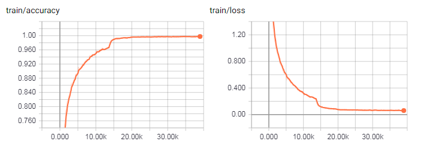
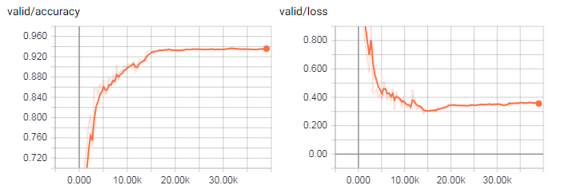

# GoogLeNet for Image Classification

- TensorFlow implementation of [Going Deeper with Convolutions](https://research.google.com/pubs/pub43022.html) (CVPR'15). 
<!-- - **The inception structure** -->
- This repository contains the examples of natural image classification using pre-trained model as well as training a Inception network from scratch on [CIFAR-10](https://www.cs.toronto.edu/~kriz/cifar.html) dataset (93.64% accuracy on testing set). The pre-trained model on CIFAR-10 can be download from [here](https://www.dropbox.com/sh/kab0bzpy0zymljx/AAD2YCVm0J1Qmlor8EoPzgQda?dl=0).
- Architecture of GoogLeNet from the paper:


## Requirements
- Python 3.3+
- [TensorFlow 1.9+](https://www.tensorflow.org/)
- [Numpy](http://www.numpy.org/)
- [Scipy](https://www.scipy.org/)

## Implementation Details

- The GoogLeNet model is defined in [`src/nets/googlenet.py`](src/nets/googlenet.py).
- Inception module is defined in [`src/models/inception_module.py`](src/models/inception_module.py).
- An example of image classification using pre-trained model is in [`examples/inception_pretrained.py`](examples/inception_pretrained.py).
- An example of train a network from scratch on CIFAR-10 is in [`examples/inception_cifar.py`](examples/inception_cifar.py).

For testing the pre-trained model
- Images are rescaled so that the smallest side equals 224 before fed into the model. This is not the same as the original paper which is an ensemble of 7 similar models using 144 224x224 crops per image for testing. So the performance will not be as good as the original paper. 
<!--- **LRN** -->

For training from scratch on CIFAR-10
- All the LRN layers are removed from the convolutional layers.
- [Batch normalization](https://arxiv.org/abs/1502.03167) and ReLU activation are used in all the convolutional layers including the layers in Inception structure except the output layer.
- Two auxiliary classifiers are used as mentioned in the paper, though 512 instead of 1024 hidden units are used in the two fully connected layers to reduce the computation. However, I found the results are almost the same on CIFAR-10 with and without auxiliary classifiers.
- Since the 32 x 32 images are down-sampled to 1 x 1 before fed into `inception_5a`, this makes the multi-scale structure of inception layers less useful and harm the performance (around **80%** accuracy). To make full use of the multi-scale structures, the stride of the first convolutional layer is reduced to 1 and the first two max pooling layers are removed. The the feature map (32 x 32 x channels) will have almost the same size as described in table 1 (28 x 28 x channel) in the paper before fed into `inception_3a`. I have also tried only reduce the stride or only remove one max pooling layer. But I found the current setting provides the best performance on the testing set.
- During training, dropout with keep probability 0.4 is applied to two fully connected layers and weight decay with 5e-4 is used as well.
- The network is trained through Adam optimizer. Batch size is 128. The initial learning rate is 1e-3, decays to 1e-4 after 30 epochs, and finally decays to 1e-5 after 50 epochs. 
- Each color channel of the input images are subtracted by the mean value computed from the training set.


## Usage
<<<<<<< HEAD
### Download pre-trained model
Download the pre-trained parameters [here](https://www.dropbox.com/sh/axnbpd1oe92aoyd/AADpmuFIJTtxS7zkL_LZrROLa?dl=0). This is original from [here](http://www.deeplearningmodel.net/).
### Config path
All directories are setup in [`example/setup_env.py`](example/setup_env.py).

- `PARA_DIR` is the path of the pre-trained model.
- `SAVE_DIR` is the directory to save graph summary for tensorboard. 
- `DATA_DIR` is the directory to put testing images.

=======
>>>>>>> 8b3f57700b6e08b9a2b11efc032ce65e195605da
### ImageNet Classification
#### Preparation
- Download the pre-trained parameters [here](https://www.dropbox.com/sh/axnbpd1oe92aoyd/AADpmuFIJTtxS7zkL_LZrROLa?dl=0). This is original from [here](http://www.deeplearningmodel.net/).
- Setup path in [`examples/inception_pretrained.py`](examples/inception_pretrained.py): `PRETRINED_PATH` is the path for pre-trained model. `DATA_PATH` is the path to put testing images.

#### Run
Go to `examples/` and put test image in folder `DATA_PATH`, then run the script:

```
python inception_pretrained.py --im_name PART-OF-IMAGE-NAME
```
- `--im_name` is the option for image names you want to test. If the testing images are all `png` files, this can be `png`. The default setting is `.jpg`.
- The output will be the top-5 class labels and probabilities.

### Train the network on CIFAR-10
#### Preparation
- Download CIFAR-10 dataset from [here](https://www.cs.toronto.edu/~kriz/cifar.html)
- Setup path in [`examples/inception_cifar.py`](examples/inception_cifar.py): `DATA_PATH` is the path to put CIFAR-10. `SAVE_PATH` is the path to save or load summary file and trained model.
#### Train the model
Go to `examples/` and run the script:

```
python inception_cifar.py --train --lr LEARNING-RATE --bsize BATCH-SIZE --keep_prob KEEP-PROB-OF-DROPOUT
--maxepoch MAX-TRAINING-EPOCH
```
- Summary and model will be saved in `SAVE_PATH`. One pre-trained model on CIFAR-10  can be downloaded from [here](https://www.dropbox.com/sh/kab0bzpy0zymljx/AAD2YCVm0J1Qmlor8EoPzgQda?dl=0).

#### Evaluate the model
Go to `examples/` and put the pre-trained model in `SAVE_PATH`. Then run the script:

```
python inception_cifar.py --eval --load PRE-TRAINED-MODEL-ID
```
- The pre-trained ID is epoch ID shown in the save modeled file name. The default value is `99`, which indicates the one I uploaded. 
- The output will be the accuracy of training and testing set.


## Results
### Image classification using pre-trained model
- Top five predictions are shown. The probabilities are shown keeping two decimal places. Note that the pre-trained model are trained on [ImageNet](http://www.image-net.org/).
- Result of VGG19 for the same images can be found [here](https://github.com/conan7882/VGG-tensorflow#results). 
**The pre-processing of images for both experiments are the same.** 

*Data Source* | *Image* | *Result* |
|:--|:--:|:--|
[COCO](http://cocodataset.org/#home) || 1: probability: 1.00, label: brown bear, bruin, Ursus arctos<br>2: probability: 0.00, label: ice bear, polar bear<br>3: probability: 0.00, label: hyena, hyaena<br>4: probability: 0.00, label: chow, chow chow<br>5: probability: 0.00, label: American black bear, black bear
[COCO](http://cocodataset.org/#home) || 1: probability: 0.79, label: street sign<br>2: probability: 0.06, label: traffic light, traffic signal, stoplight<br>3: probability: 0.03, label: parking meter<br>4: probability: 0.02, label: mailbox, letter box<br>5: probability: 0.01, label: balloon
[COCO](http://cocodataset.org/#home) ||1: probability: 0.94, label: trolleybus, trolley coach<br>2: probability: 0.05, label: passenger car, coach, carriage<br>3: probability: 0.00, label: fire engine, fire truck<br>4: probability: 0.00, label: streetcar, tram, tramcar, trolley<br>5: probability: 0.00, label: minibus
[COCO](http://cocodataset.org/#home) ||1: probability: 0.35, label: burrito<br>2: probability: 0.17, label: potpie<br>3: probability: 0.14, label: mashed potato<br>4: probability: 0.10, label: plate<br>5: probability: 0.03, label: pizza, pizza pie
[ImageNet](http://www.image-net.org/) ||1: probability: 1.00, label: goldfish, Carassius auratus<br>2: probability: 0.00, label: rock beauty, Holocanthus tricolor<br>3: probability: 0.00, label: puffer, pufferfish, blowfish, globefish<br>4: probability: 0.00, label: tench, Tinca tinca<br>5: probability: 0.00, label: anemone fish
Self Collection | |1: probability: 0.32, label: Egyptian cat<br>2: probability: 0.30, label: tabby, tabby cat<br>3: probability: 0.05, label: tiger cat<br>4: probability: 0.02, label: mouse, computer mouse<br>5: probability: 0.02, label: paper towel
Self Collection | |1: probability: 1.00, label: streetcar, tram, tramcar, trolley, trolley car<br>2: probability: 0.00, label: passenger car, coach, carriage<br>3: probability: 0.00, label: trolleybus, trolley coach, trackless trolley<br>4: probability: 0.00, label: electric locomotive<br>5: probability: 0.00, label: freight car

### Train the network from scratch on CIFAR-10
- [Here](https://github.com/conan7882/VGG-cifar-tf/blob/master/README.md#train-the-network-from-scratch-on-cifar-10) is a similar experiment using VGG19.

learning curve for training set 



learning curve for testing set 
- The accuracy on testing set is 93.64% around 100 epochs. We can observe the slightly over-fitting behavior at the end of training.



## Author
Qian Ge
